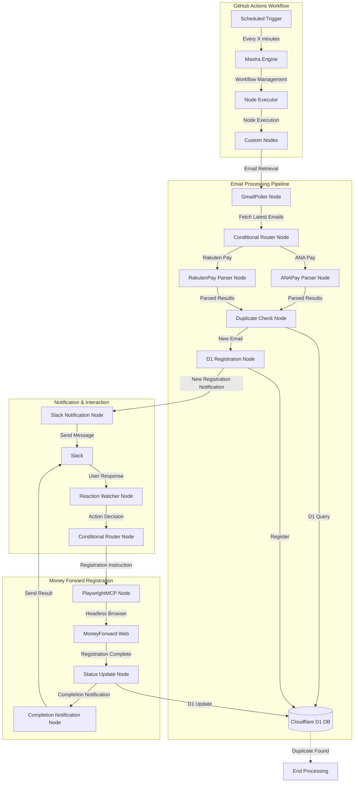

# Architecture Documentation

## System Overview
This document describes the architecture of the mf-auto-reg system, which uses the Mastra framework to automatically register ANA Pay and Rakuten Pay email notifications in MoneyForward.

## Execution Environment

The system uses GitHub Actions to execute the Playwright MCP in headless mode, eliminating the need for dedicated server infrastructure. This serverless approach provides the following benefits:

- **Cost Efficiency**: Utilizes GitHub's free tier minutes for periodic execution
- **Zero Infrastructure Management**: No need to maintain dedicated servers
- **Built-in Scheduling**: Native cron scheduling for regular email checking
- **Automatic Logging**: Execution logs and history maintained by GitHub
- **Secret Management**: Secure storage of credentials via GitHub Secrets

## Flow Diagram



## Component Details

### 1. GitHub Actions Workflow
- **Scheduled Trigger**: Executes the workflow on a defined schedule
- **Workflow Environment**: Ubuntu runner with Node.js and Playwright installed
- **Secret Management**: Stores API tokens, credentials, and configuration securely

### 2. Mastra Agent Framework
- **Mastra Engine**: Manages workflow execution and management
- **Node Executor**: Executes nodes based on conditions
- **Custom Nodes**: Collection of nodes implementing specific functionality

### 3. Email Processing Pipeline
- **GmailPoller Node**: Handles Gmail API authentication and email retrieval
- **Conditional Router Node**: Routes processing based on service type
- **ANAPay Parser Node**: Extracts transaction details from ANA Pay emails
- **RakutenPay Parser Node**: Extracts transaction details from Rakuten Pay emails
- **Duplicate Check Node**: Verifies if the transaction is already processed
- **D1 Registration Node**: Stores new transaction data

### 4. Notification & Interaction
- **Slack Notification Node**: Manages communication with Slack
- **Reaction Watcher Node**: Handles user reactions and commands
- **Conditional Router Node**: Determines next steps based on user input

### 5. Money Forward Registration
- **PlaywrightMCP Node**: Controls web browser using Playwright MCP in headless mode
- **Status Update Node**: Updates transaction status in D1
- **Completion Notification Node**: Reports registration status

## Data Flow

1. **Scheduled Execution**
   - GitHub Actions triggers the workflow based on schedule
   - Sets up the environment and installs dependencies
   - Launches the Mastra engine with Playwright MCP in headless mode

2. **Email Detection**
   - Mastra Engine executes the GmailPoller Node
   - Retrieves latest 100 emails
   - Filters for ANA Pay and Rakuten Pay notifications

3. **Processing**
   - Uses appropriate parser based on service provider
   - Parses email content for transaction details
   - Checks Cloudflare D1 for duplicates
   - Stores new transactions

4. **User Interaction**
   - Notifies user via Slack
   - Waits for user reaction/response
   - Processes user commands

5. **Registration**
   - Initiates headless browser automation with PlaywrightMCP Node
   - Logs into MoneyForward
   - Registers transaction
   - Updates registration status in Cloudflare D1
   - Confirms completion

## GitHub Actions Configuration

The system uses a workflow file (`.github/workflows/email-processor.yml`) that runs on a schedule:

```yaml
name: Process Emails
on:
  schedule:
    - cron: '*/10 * * * *'  # Run every 10 minutes
  workflow_dispatch:  # Allow manual triggers

jobs:
  process:
    runs-on: ubuntu-latest
    steps:
      - uses: actions/checkout@v3
      - uses: actions/setup-node@v3
        with:
          node-version: '18'
      - name: Install dependencies
        run: npm ci
      - name: Setup Playwright
        run: npx playwright install --with-deps chromium
      - name: Run Mastra workflow
        env:
          # Environment variables from GitHub Secrets
          GMAIL_CLIENT_ID: ${{ secrets.GMAIL_CLIENT_ID }}
          GMAIL_CLIENT_SECRET: ${{ secrets.GMAIL_CLIENT_SECRET }}
          # Additional secrets...
        run: node src/index.js
```

## Mastra Workflow Definition

Workflows are defined in YAML files as follows:

```yaml
name: "MoneyForward Auto Registration"
description: "Workflow to automatically register ANA Pay and Rakuten Pay email notifications in MoneyForward"

nodes:
  - name: "EmailPolling"
    type: "GmailPoller"
    config:
      searchQueries:
        - "[ANA Pay] ご利用のお知らせ"
        - "[楽天ペイ] ご利用のお知らせ"
      maxResults: 100
      pollInterval: 60000
    next: "EmailParser"

  # Additional node definitions...
```

## Playwright MCP Configuration

Playwright MCP is configured to run in headless mode within the GitHub Actions environment:

```json
{
  "mcpServers": {
    "playwright": {
      "command": "npx",
      "args": [
        "@playwright/mcp@latest",
        "--headless"
      ]
    }
  }
}
```
