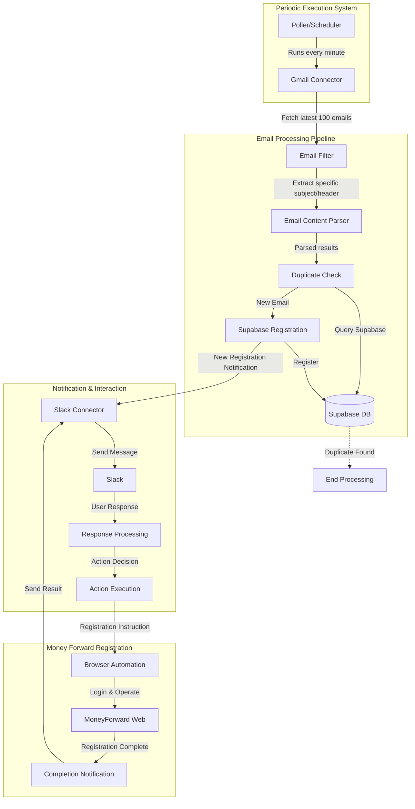

# Architecture Documentation

## System Overview
This document describes the architecture of the mf-auto-reg system, which automatically processes ANA Pay email notifications and registers them in MoneyForward.

## Flow Diagram

## Component Details

### 1. Periodic Execution System
- **Poller/Scheduler**: Runs every minute to check for new emails
- **Gmail Connector**: Handles Gmail API authentication and email retrieval

### 2. Email Processing Pipeline
- **Email Filter**: Filters emails based on specific subject and headers
- **Email Content Parser**: Extracts transaction details from email content
- **Duplicate Check**: Verifies if the transaction is already processed
- **Supabase Registration**: Stores new transaction data

### 3. Notification & Interaction
- **Slack Connector**: Manages communication with Slack
- **Response Processing**: Handles user reactions and commands
- **Action Execution**: Determines next steps based on user input

### 4. Money Forward Registration
- **Browser Automation**: Controls web browser using Browser Use
- **Registration Process**: Handles MoneyForward login and data entry
- **Completion Notification**: Reports registration status

## Data Flow

1. **Email Detection**
   - Scheduler triggers Gmail check every minute
   - Retrieves latest 100 emails
   - Filters for ANA Pay notifications

2. **Processing**
   - Parses email content for transaction details
   - Checks Supabase for duplicates
   - Stores new transactions

3. **User Interaction**
   - Notifies user via Slack
   - Waits for user reaction/response
   - Processes user commands

4. **Registration**
   - Initiates Browser Use automation
   - Logs into MoneyForward
   - Registers transaction
   - Confirms completion

## Error Handling

- Gmail API connection failures
- Supabase database errors
- Slack communication issues
- Browser automation failures
- MoneyForward access problems

## Security Considerations

- Secure storage of credentials
- API token management
- Database access control
- Secure browser automation 