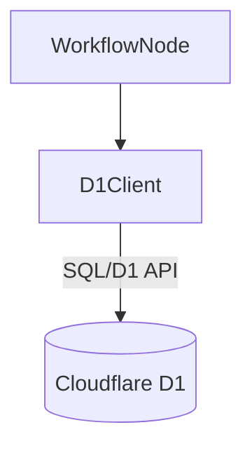

# Design Doc 002: Cloudflare D1 Client for Transaction Storage

**Date:** 2024-07-29 <!-- Update if needed -->

## 1. Context & Scope
This document outlines the design for a client library to interact with Cloudflare D1. The primary purpose of this client is to store parsed transaction information extracted from emails. This persistent storage is necessary to:
- Prevent duplicate registration of the same transaction in MoneyForward.
- Track the status of each transaction (e.g., pending, registered, error).
- Provide a basis for potential future reporting or auditing.

This design focuses *only* on the client library responsible for database interactions (CRUD operations on the transaction table).

**Out of Scope:**
- The email parsing logic itself.
- The MoneyForward registration workflow node.
- Any user interface components.
- Complex data analysis or reporting features.
- Setting up the D1 database itself (handled via Wrangler config).

**Related GitHub Issue:** <!-- Link to the issue tracking D1 implementation -->

## 2. Goals & Non-Goals
**Goals:**
- Define the database schema for storing transaction details in D1.
- Implement a TypeScript client (`src/lib/d1Client.ts`) to interact with the D1 database.
- Implement a function `checkDuplicate(source_email_id: string): Promise<boolean>` to check if a transaction from a specific email already exists.
- Implement a function `registerTransaction(data: TransactionData): Promise<string>` to insert a new transaction record and return its unique ID.
- Implement a function `updateTransactionStatus(id: string, status: 'pending' | 'registered' | 'error'): Promise<void>` to update the MoneyForward registration status of a transaction.
- Include basic error handling for database operations.

**Non-Goals:**
- Implementing transaction deletion functionality.
- Supporting complex queries beyond simple lookups and updates.
- Managing database migrations (initially handled manually or via Wrangler).
- Providing an abstraction layer over different database types.

## 3. Proposed Design

### 3.1 Overview
We will create a simple TypeScript module or class that encapsulates all interactions with the Cloudflare D1 database configured for this project. This client will expose specific functions for the required operations (checking duplicates, registering, updating status). It will utilize the D1 bindings provided by the Cloudflare Workers environment.



### 3.2 Component Details / Implementation Sketch
- **File:** `src/lib/d1Client.ts`
- **Dependencies:** `@cloudflare/workers-types` (for D1 binding types)
- **Interface (Example):**
  ```typescript
  interface TransactionData {
    source_email_id: string; // Unique identifier derived from the source email
    parsed_data: Record<string, any>; // The structured transaction data
    mf_status: 'pending' | 'registered' | 'error';
  }

  interface D1Client {
    checkDuplicate(source_email_id: string): Promise<boolean>;
    registerTransaction(data: Omit<TransactionData, 'mf_status'>): Promise<string>; // Returns new transaction ID
    updateTransactionStatus(id: string, status: TransactionData['mf_status']): Promise<void>;
  }
  ```
- **Implementation:** Functions will use `env.DB.prepare()` and `stmt.bind().run()`, `stmt.bind().first()`, etc., to execute SQL statements against the D1 database instance (bound as `env.DB`). Generate a UUID (e.g., using `crypto.randomUUID()`) for the primary key within `registerTransaction`.

### 3.3 Data Schema (Cloudflare D1)
**Table:** `transactions`

| Column Name       | Data Type           | Constraints                     | Description                                      |
|-------------------|---------------------|---------------------------------|--------------------------------------------------|
| `id`              | TEXT                | PRIMARY KEY                     | Unique identifier for the transaction (UUID)     |
| `source_email_id` | TEXT                | NOT NULL, UNIQUE                | Unique ID derived from the source email message  |
| `parsed_data`     | TEXT                | NOT NULL                        | JSON string containing the parsed transaction details |
| `mf_status`       | TEXT                | NOT NULL, CHECK (mf_status IN ('pending', 'registered', 'error')) | Status of MoneyForward registration            |
| `created_at`      | TIMESTAMP           | NOT NULL, DEFAULT CURRENT_TIMESTAMP | Timestamp of record creation                     |
| `updated_at`      | TIMESTAMP           | NOT NULL, DEFAULT CURRENT_TIMESTAMP | Timestamp of last record update (trigger needed or update manually) |

*Note: D1 might have slightly different type names (e.g., INTEGER for timestamps). Adjust as needed based on D1 specifics.*
*Note: An explicit `ON UPDATE CURRENT_TIMESTAMP` trigger might not be available in D1; `updated_at` may need manual updates.*

## 4. Alternatives Considered (Optional)
- **Cloudflare KV:** Simpler key-value store. Rejected because relational queries (like checking `UNIQUE` constraints easily or potentially filtering by status later) are desired.
- **Cloudflare R2:** Object storage. Not suitable for structured, queryable data like transactions.
- **External Database (e.g., Neon, Supabase):** More powerful, but adds external dependency and potential latency. D1 offers tight integration with Workers.

## 5. Open Questions / Discussion Points
- **Duplicate Check Window:** How far back should `checkDuplicate` look? For now, assume checking the entire `source_email_id` history is sufficient.
- **UUID Generation:** Generate UUIDs in the client code (`crypto.randomUUID()`) or rely on a potential future D1 default function? Client-side generation is simpler for now.
- **`updated_at` Handling:** How to ensure `updated_at` is reliably updated? Manually set it in the `updateTransactionStatus` query.

## 6. Impact / Cross-Cutting Concerns (Optional)
- **Security:** D1 database credentials/bindings need to be securely managed in the Cloudflare environment (`wrangler.toml`).
- **Testing:** D1 interactions need to be mocked for unit tests. Integration tests might require a dedicated test D1 database or careful cleanup. Consider `vitest-mock-extended` or similar for mocking the D1 binding.
- **Cost:** D1 usage costs should be monitored, although likely minimal for this scope.
- **Observability:** Log database errors and potentially slow queries.

## 7. Testing Strategy

- **Unit Tests:**
  - Target: `src/lib/d1Client.ts` functions (`checkDuplicate`, `registerTransaction`, `updateTransactionStatus`).
  - Framework: Jest (or Vitest, if preferred).
  - Mocking: The D1 database binding (`env.DB`) needs to be mocked extensively using Jest's mocking capabilities to isolate the client logic.
    - **Option 1 (Recommended): Mocking Library:** Use `jest-mock-extended` to easily mock the `D1Database` interface (`@cloudflare/workers-types`). This allows straightforward simulation of method calls like `prepare`, `bind`, `run`, `first`, `all`, and their return values (including mocked data or errors).
    - **Option 2: Manual Mock:** Use Jest's built-in mocking feature (`jest.mock`) to manually mock the `env.DB` object and its chained methods. This requires careful setup to replicate the method chain (`prepare().bind().run()`) behavior.
    - Create test helper functions to streamline the mock setup for common D1 interaction patterns.
  - Coverage: Aim for high coverage of the `d1Client.ts` logic, focusing on SQL generation, parameter binding, data transformation, and error handling scenarios.

- **Integration / E2E Tests:**
  - Focus: Verifying the interaction between the `D1Client` and other workflow components, and the end-to-end workflow involving D1 operations (e.g., preventing duplicates based on database checks).
  - Approach: Utilize **Cloudflare Wrangler's local emulation** (`wrangler dev --local`).
    - **Setup:** Configure the D1 binding in `wrangler.toml`. Running `wrangler dev --local` (or your test runner integrating with it) will automatically create and manage a local SQLite file emulating D1 (typically in `.wrangler/state/v3/d1/`).
    - **Schema & Data Management:**
      - Before tests run (e.g., in a global setup file or `beforeAll` hook), apply the database schema using `wrangler d1 execute <YOUR_DB_BINDING_NAME> --local --file=./path/to/schema.sql`.
      - Seed necessary test data using `wrangler d1 execute --local --command="INSERT INTO ..."` or via client functions.
      - After tests (e.g., in `afterAll`), clean up by deleting test data (`DELETE FROM transactions`) or removing the generated local database file to ensure test isolation.
    - This approach provides a high-fidelity testing environment that closely mirrors the actual Cloudflare Workers runtime with D1. 