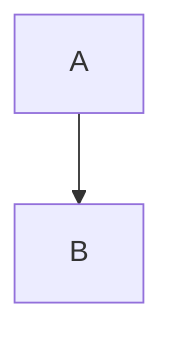

# Design Doc XXX: [Feature/Change Title]

**Date:** YYYY-MM-DD

## 1. Context & Scope
<!--
What is the background for this change? What problem is it solving?
What are the boundaries? What is explicitly out of scope for *this* design doc?
Link to relevant GitHub Issues if applicable (e.g., the issue tracking the implementation task).
-->

## 2. Goals & Non-Goals
<!--
List the specific, measurable goals for this change. What should it achieve?
List things that might seem like goals but are explicitly *not* goals for this change.
-->
**Goals:**
- Goal 1
- Goal 2

**Non-Goals:**
- Non-goal 1
- Non-goal 2

## 3. Proposed Design
<!--
Describe the proposed solution in sufficient detail. Focus on the "how".
- How will the components interact? (Diagrams using Mermaid are helpful)
- What new files/modules/classes/functions will be created?
- What key data structures or APIs will be defined/used?
- Explain the key technical decisions and trade-offs considered. Why this approach over others?
-->

### 3.1 Overview / Diagram (Optional)
<!-- Mermaid diagram or high-level description -->

### 3.2 Component Details / Implementation Sketch
<!-- Specific details about the implementation -->

### 3.3 Data Schema / API (If applicable)
<!-- Details about DB schema, API request/response formats -->

## 4. Alternatives Considered (Optional)
<!--
Briefly describe other significant approaches that were considered.
Explain why they were not chosen, focusing on the trade-offs.
-->
- **Alternative A:** ... (Reason rejected: ...)
- **Alternative B:** ... (Reason rejected: ...)

## 5. Open Questions / Discussion Points
<!--
List any unresolved questions, areas needing further investigation, or points for discussion.
-->
- Question 1?
- Need clarification on X.

## 6. Impact / Cross-Cutting Concerns (Optional)
<!--
Consider potential impacts on:
- Security: Any new vulnerabilities or mitigation needed?
- Privacy: Handling sensitive data?
- Performance: Potential bottlenecks?
- Observability: How will we monitor this?
- Testing Strategy: How will this be tested?
-->

## 7. Testing Strategy
<!--
How will this feature/change be tested?
- Unit Tests: What key components or functions need unit tests? What needs mocking?
- Integration Tests: How will the interaction between components be tested?
- End-to-End (E2E) Tests: Is an E2E test necessary? What user flow should it cover?
- Mention specific tools or libraries (e.g., Jest, Playwright, vitest-mock-extended).
--> 